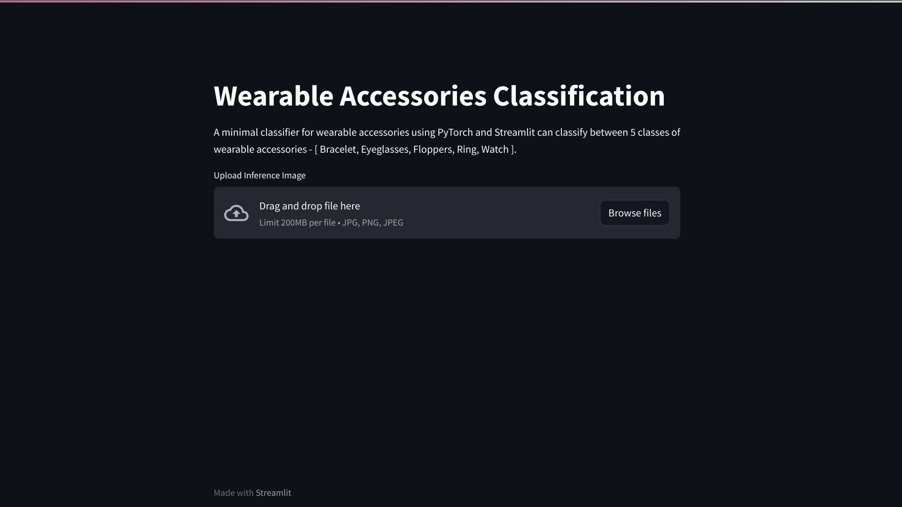

## Minor Project - 1  >> Visual Computing Lab 

* Minimal Classifiers for Wearable  Accessories

### Aaditya Baranwal

* B20EE001

### Dataset

>> The dataset consists of 180 images of 5 different classes of wearable accessories. The dataset is divided into 2 parts: Training and Testing. The training dataset consists of 150 images and the testing dataset consists of 30 images. The link to the dataset is given below:  
[Dataset](https://drive.google.com/drive/folders/1mdo8iInqFGXEhJxhW6qJ06tYs-78xa5M?usp=sharing)

### WebAPP

 

### Report
[Document](assets/report.pdf)
